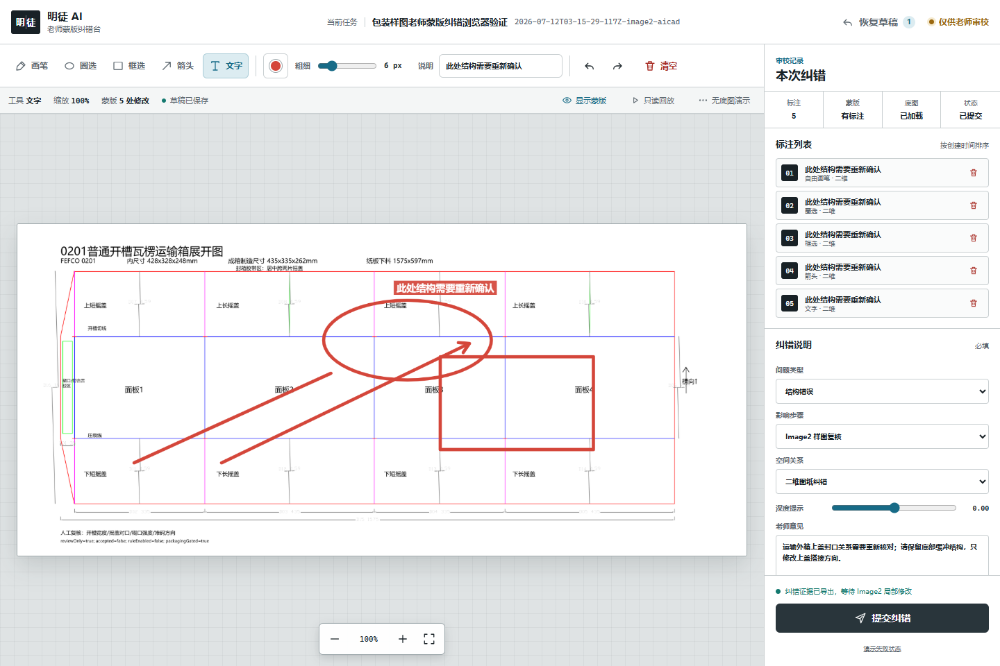

<div align="center">

# 明徒 AI

**看得见成长，教得会做事。**

可教学、可纠错、可追踪的智能学徒系统

</div>



明徒 AI（MingTu AI）让用户像带教新同事一样培养 AI。它会先问清需求、规划方案，再执行和自查；用户可以通过文字、示范、截图或图上蒙版纠正结果。每次执行都会留下结构化步骤、证据、规则、置信度和人工复核点，纠错只会形成默认停用的规则草稿，不会悄悄变成自动权限。

首版重点打通了完整的包装设计教学闭环：


## 为什么叫明徒

“明徒”同时表达两层含义：让智能学徒的学习和执行过程清楚可见，也保留“老师带徒弟”的产品关系。产品不是普通聊天机器人，也不是只给结果的黑盒自动化工具；它的核心是人能教、能改、能复核，AI 能把正确方法逐步沉淀下来。

## 当前能力

| 能力 | 状态 | 首版说明 |
| --- | --- | --- |
| 创建智能学徒与可教学任务 | 已实现 | 支持任务目标、教学上下文和种子数据 |
| 结构化执行轨迹 | 已实现 | 展示步骤、规则、证据、置信度、验证结果和人工审核点 |
| 文字、示范、截图与案例教学 | 已实现 | 教学输入会形成可复核的结构化证据 |
| 纠错转规则草稿 | 已实现 | 新规则默认停用，必须由老师审核 |
| 知识资料与 RAG 证据包 | 已实现，需人工判断 | 检索结果带来源，但不具备自动授权能力 |
| 包装需求澄清与方案规划 | 已实现 | 八阶段状态机禁止跳过关键步骤 |
| Image2 中文包装样图 | 已实现，需人工复核 | 依赖运行环境提供 Image2；图片用于视觉方案，不是工程尺寸真值 |
| 尺寸、形状和制造自查 | 已实现，需工程复核 | 自动检查是交付前筛查，不是技术验收 |
| 老师蒙版与文字纠错 | 已实现 | 五种标注工具、草稿、回放、触控和结构化导出 |
| Image2 局部修改交接 | 已实现，需人工复核 | 只修改标注区域，并要求保留未标注区域 |
| AICAD 确定性二维工程图 | 已实现，需工程复核 | 严格请求/结果协议、哈希绑定和离线几何验证 |
| SolidWorks 三维候选模型 | 已实现，需真实宿主复核 | 保留历史宿主证据；本次发布不声称完成现场验收 |
| 自动技术验收或量产放行 | 不提供 | 必须由有权限的老师、工程师或组织流程完成 |

## 包装闭环

### 1. 需求澄清

系统先确认产品类型、净尺寸、重量、材料、运输条件、开合方式、印刷要求和制造约束。尺寸、材料厚度等关键工程输入未确认时，流程不能进入 CAD 交接。

### 2. 深度方案

根据需求选择包装结构，列出参数来源、结构关系、风险点、制造假设和验证计划。方案是后续 Image2 与 CAD 共用的约束来源。

### 3. Image2 中文样图

按统一的中文工程版式生成视觉候选图。中文文字、尺寸表和布局在提示词中单独约束，避免简单翻译造成排版重排。

### 4. 样图自查

交付前必须检查尺寸完整性、单位一致性、面板拓扑、刀线与压线冲突、闭合间隙、制造可行性和标注可读性。系统明确记录：Image2 像素不能用于反推工程尺寸。

### 5. 老师蒙版纠错

明徒审校台支持自由画笔、圈选、框选、箭头和文字；同时提供颜色、粗细、撤销、重做、清空确认、缩放适配、标注列表、蒙版显隐、草稿恢复、无底图状态、只读回放、键盘和触控。

纠错会导出兼容 `mingtu_teacher_mask_correction_v1` 与 `transparent_ai_sketch_overlay_packet_v1` 的数据包，包含归一化坐标、问题类型、影响步骤、老师意见、空间关系、深度提示和安全锁。

### 6. Image2 局部修改

局部修改只针对老师标注区域，并明确要求保留未标注区域。修改结果需要再次复核，不能因为图像看起来合理就进入工程制图。

### 7. AICAD 工程制图

确认后的尺寸、材料和纠错证据会复制到会话内的交接目录，使用相对路径、媒体类型和 SHA-256 哈希生成 `mingtu_aicad_request_v1`。AICAD 1.2.0 使用确定性几何生成二维候选工程图，并可准备受控的 AutoCAD 或 SolidWorks 宿主流程。

CAD 回收会核对会话与请求绑定、生产者版本、请求哈希、输出路径范围和产物哈希。错误必须包含根因与修复建议；预防规则仍保持 `draft_disabled`。

### 8. 最终人工复核

系统回收 CAD 结果后进入最终老师/工程师复核。自动验证通过仍不等于技术验收、生产验收或量产批准。

## 十分钟开始

环境要求：Node.js 22–24、npm 10+、Python 3，以及 Windows PowerShell。真实 Image2、AutoCAD 和 SolidWorks 能力取决于当前 Codex/宿主环境。

```powershell
npm ci
npm run typecheck
npm test
npm run verify:plugin
```

验证首版关键闭环：

```powershell
npm run smoke:packaging-workflow
npm run smoke:mask-workbench
npm run verify:aicad-manifest
npm run verify:aicad-integration
npm run smoke:aicad-handoff
npm run smoke:plugin-tool-surface
```

生成可安装插件包：

```powershell
npm run package:codex-plugin
```

本地安装：

```powershell
npm run install:codex-plugin
```

启动 Web 产品：

```powershell
npm run dev
```

## 插件结构

```text
plugins/transparent-ai-apprentice/
├─ .codex-plugin/             插件清单与中文入口
├─ .mcp.json                  明徒 MCP 与 AICAD MCP 服务
├─ assets/mask-workbench/     老师蒙版纠错台模板、样式和交互
├─ integrations/aicad-agent-v1/
│  └─ plugin/aicad-agent/     完整 AICAD 1.2.0 集成
├─ schemas/                   包装会话、AICAD 请求与结果协议
├─ scripts/                   教学闭环、包装状态机、验证与烟测
└─ skills/                    学徒、包装设计与 CAD 技能说明
```

核心入口：

- [`packaging-design-workflow.mjs`](plugins/transparent-ai-apprentice/scripts/packaging-design-workflow.mjs)：八阶段包装状态机。
- [`create-transparent-sketch-overlay-kit.mjs`](plugins/transparent-ai-apprentice/scripts/create-transparent-sketch-overlay-kit.mjs)：生成独立中文蒙版工作台。
- [`aicad-handoff-adapter.mjs`](plugins/transparent-ai-apprentice/scripts/aicad-handoff-adapter.mjs)：明徒与 AICAD 的兼容及离线编译桥。
- [`mingtu-aicad-request-v1.schema.json`](plugins/transparent-ai-apprentice/schemas/mingtu-aicad-request-v1.schema.json)：严格 CAD 请求协议。
- [`mingtu-aicad-result-v1.schema.json`](plugins/transparent-ai-apprentice/schemas/mingtu-aicad-result-v1.schema.json)：绑定请求和产物哈希的结果协议。

## 人工测试建议

1. 用一个真实产品提出包装需求，故意漏掉重量或材料厚度，确认系统继续追问且不能提前进入 CAD。
2. 生成中文 Image2 样图，检查中文、尺寸表、结构分区和整体版式。
3. 在审校台分别使用五种标注工具，测试撤销、重做、刷新恢复草稿、手机触控和只读回放。
4. 提交一条“只改上盖搭接方向，保留底部缓冲”的局部修改，确认未标注区域不被重绘。
5. 篡改 AICAD 请求或结果哈希，确认交接被拒绝。
6. 在真实 CAD 宿主中打开输出，检查尺寸、闭合、刀线/压线、材料和保存重开。
7. 确认整个流程始终没有自动显示“已验收”“已投产”或“规则已启用”。

详细清单见 [`docs/manual-testing.md`](docs/manual-testing.md)。

## 安全边界

- RAG 检索内容是带来源的证据，不是自动权威。
- Image2 视觉比例和像素不是工程尺寸来源。
- 自动检查通过不等于技术验收、生产验收或量产批准。
- 人工纠错只生成待审核规则草稿，不自动启用规则。
- AICAD 输出是工程候选结果，仍需在目标软件和真实生产条件下复核。
- 默认保持 `accepted=false`、`ruleEnabled=false`、`technologyAccepted=false`、`packagingGated=true`。

## 验证证据

首版发布门槛包括：

- 插件完整性检查：349 项。
- 包装状态机烟测：20 项，最终进入 `final_teacher_review`。
- 蒙版工作台真实 Chromium 烟测：7 项，覆盖桌面、手机和交互状态。
- AICAD 集成测试：6 项；适配器烟测：10 项；集成清单：87 个文件哈希。
- AICAD 上游包：1.2.0，41 项核心与回归测试；真实宿主证据按历史证据标记，不伪装成本次执行。

这些结果证明实现和锁定边界可重复验证，但不替代真实用户测试、工程复核或生产验收。

## 文档

- [品牌与产品文案](docs/brand-and-product-copy.md)
- [人工测试手册](docs/manual-testing.md)
- [架构与边界](docs/architecture.md)
- [AICAD 主项目集成说明](plugins/transparent-ai-apprentice/integrations/aicad-agent-v1/docs/MAIN_PROJECT_INTEGRATION.md)
- [AICAD 插件说明](plugins/transparent-ai-apprentice/integrations/aicad-agent-v1/plugin/aicad-agent/README.md)
- [贡献指南](CONTRIBUTING.md)
- [安全说明](SECURITY.md)

## 版本与许可

当前首版：`1.0.0`。

明徒 AI 以 MIT License 发布。第三方或集成组件继续遵循其各自目录中的许可证与再分发说明。
