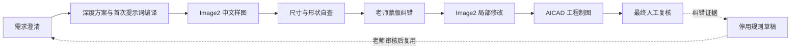

<div align="center">

# AI 学徒

**通过示范、纠错和审核，逐步学会做事。**

可教学、可纠错、可追踪的智能学徒系统

</div>


AI 学徒（AI Apprentice）让用户像带教新同事一样培养 AI。它会先问清需求、规划方案，再执行和自查；用户可以通过文字、示范、截图或图上蒙版纠正结果。每次执行都会留下结构化步骤、证据、规则、置信度和人工复核点，纠错只会形成默认停用的规则草稿，不会悄悄变成自动权限。

首版重点打通了完整的包装设计教学闭环：



## 为什么叫 AI 学徒

这个名字直接描述产品功能：它不是普通聊天机器人，也不是只给结果的黑盒自动化工具，而是一个能够被人教学、纠错和复核，并逐步沉淀正确方法的 AI 工作助手。

## 当前能力

| 能力 | 状态 | 首版说明 |
| --- | --- | --- |
| 创建智能学徒与可教学任务 | 已实现 | 支持任务目标、教学上下文和种子数据 |
| 结构化执行轨迹 | 已实现 | 展示步骤、规则、证据、置信度、验证结果和人工审核点 |
| 文字、示范、截图与案例教学 | 已实现 | 教学输入会形成可复核的结构化证据 |
| 纠错转规则草稿 | 已实现 | 新规则默认停用，必须由老师审核 |
| 自然沟通与语气纠偏 | 已实现 | 按澄清、纠错、失败、进度和情绪场景调整表达，不假装真人或诱导依赖 |
| 知识资料与 RAG 证据包 | 已实现，需人工判断 | 检索结果带来源，但不具备自动授权能力 |
| Image2 首次生成提示词优化 | 已实现 | 先路由现有能力，再编译可验证指导包；本机 12.5 万条提示词库为可选增强 |
| 包装需求澄清与方案规划 | 已实现 | 八阶段状态机禁止跳过关键步骤 |
| Image2 中文包装样图 | 已实现，需人工复核 | 依赖运行环境提供 Image2；图片用于视觉方案，不是工程尺寸真值 |
| 尺寸、形状和制造自查 | 已实现，需工程复核 | 自动检查是交付前筛查，不是技术验收 |
| 原工程图片蒙版 | 已恢复并保持独立 | 延续原有画笔、圈选、框选、箭头和文字纠错，不加入内容类型切换 |
| Word / Excel 文字蒙版 | 已实现，独立入口 | 绑定段落或单元格、原文和替换文字，不与图片蒙版混用 |
| 工程软件对象蒙版 | 已实现，独立入口 | 绑定对象编号、参数、保护区和参考关系，不替换原工程图片蒙版 |
| 蒙版任务提交与回放 | 已实现 | 提交进入持久任务、审核、重试和结果回放；离线时进入本地待重试队列，不显示假成功 |
| Word / Excel 原生点改 | 已实现 | 支持 Word 段落、表格单元格和跨 run 富文本；支持 Excel 合并锚点与共享富文本；源文件不覆盖，其他 OOXML 部件逐项验哈希 |
| Image2 局部修改交接 | 已实现，需人工复核 | 只修改选中区域，外部差异超限即拒绝结果 |
| 规则差异决策与问题标记 | 已实现 | 按上下文、具体性、老师例外和风险做决定，不静默丢弃规则 |
| AICAD 对象定点修改 | 已实现，需工程复核 | 首个适配器可把审核后的 D04 原生约束从 420 改为 450 mm，生成 AICAD/SCR/DXF，并验证 D08/D10 不变和精确回滚 |
| AICAD 确定性二维工程图 | 已实现，需工程复核 | 严格请求/结果协议、哈希绑定和离线几何验证 |
| SolidWorks 三维候选模型 | 已实现，需真实宿主复核 | 保留历史宿主证据；本次发布不声称完成现场验收 |
| 自动技术验收或量产放行 | 不提供 | 必须由有权限的老师、工程师或组织流程完成 |

## 包装闭环

### 1. 需求澄清

系统先确认产品类型、净尺寸、重量、材料、运输条件、开合方式、印刷要求和制造约束。尺寸、材料厚度等关键工程输入未确认时，流程不能进入 CAD 交接。

### 2. 深度方案

根据需求选择包装结构，列出参数来源、结构关系、风险点、制造假设和验证计划。随后由 `image2-prompt-optimizer` 编译 `mingtu_image2_initial_prompt_guidance_v1`，把确认事实、保留项、修改项、版式、负面约束和检查项分开记录。

### 3. Image2 中文样图

只有提示词指导包 `readyForGeneration=true` 时才按统一的中文工程版式生成视觉候选图。中文文字、尺寸表和布局单独约束，避免简单翻译造成排版重排。

### 4. 样图自查

交付前必须检查尺寸完整性、单位一致性、面板拓扑、刀线与压线冲突、闭合间隙、制造可行性和标注可读性。系统明确记录：Image2 像素不能用于反推工程尺寸。

### 5. 老师蒙版纠错

蒙版分成三个独立入口。原工程图片审校台保持原版界面与行为；办公文字蒙版只处理 Word / Excel 原生文字，绑定 `paragraph:N` 或 `工作表!单元格`；工程软件蒙版只处理软件截图上的对象编号、动作、目标值、单位、保护区和参考关系。三套页面互不提供内容类型切换。

纠错会导出 `mingtu_multimodal_surgical_mask_correction_v1` 兼容数据包，包含精确变更边界、禁止改动区域、原生对象定位器、前后对比要求和安全锁。Word / Excel 点改会生成独立输出和差异报告，证明源文件未覆盖且只有目标 OOXML 部件变化。

两个新增工作台的提交按钮已接入 `mask-correction-service.mjs`。服务保存任务、数据包哈希、审核决定、重试次数、执行结果和事件历史；服务不可用时页面明确报告失败，并把任务放入浏览器待重试队列。

### 6. Image2 局部修改

各专用工作台都只修改明确目标：图片由原工程图片蒙版继续交给 Image2 局部修改；Office 检查未选中包部件；工程软件检查未选中实体、参数、约束和拓扑。局部修改不可行时先停下，整体重生成只能作为单独候选交给老师选择，不能覆盖当前可行结果。

### 7. AICAD 工程制图

确认后的尺寸、材料和纠错证据会复制到会话内的交接目录，使用相对路径、媒体类型和 SHA-256 哈希生成 `mingtu_aicad_request_v1`。AICAD 1.2.0 使用确定性几何生成二维候选工程图，并可准备受控的 AutoCAD 或 SolidWorks 宿主流程。

CAD 回收会核对会话与请求绑定、生产者版本、请求哈希、输出路径范围和产物哈希。错误必须包含根因与修复建议；预防规则仍保持 `draft_disabled`。

首个对象适配器 `aicad-object-mask-adapter.mjs` 已能消费审核通过的工程蒙版任务，局部修改 AICAD 原生约束计划并生成 `.aicad`、AutoCAD `.scr`、`.dxf`、审计报告和清单。每次修改先复制回滚点，完成后逐对象比较哈希，只有老师指定的对象可以变化。

## 产品化验证

- `npm run smoke:mask-correction-service`：持久提交、审核、重试与结果回放。
- `npm run smoke:mask-submission-browser`：真实浏览器提交与离线待重试队列。
- `npm run smoke:aicad-object-mask-adapter`：AICAD 对象修改、编译、验证与回滚。
- `npm run smoke:multiround-learning`：第一次失败、老师纠正、第二次正确、跨会话记忆和禁用。
- `npm run smoke:office-surgical-edit`：普通与复杂 Word/Excel 原生点改。
- `npm run smoke:product-failure-matrix`：29 个真实 Office、CAD、蒙版和包装图失败场景。
- `npm run benchmark:product`：冷启动、页面、大文件、并发、长序列、内存和 AICAD 性能基线。

默认 MCP 只显示 7 个老师入口，高级模式显示 30 个任务型入口；388 个底层维护工具只在 `TRANSPARENT_AI_APPRENTICE_TOOL_MODE=full` 时列出。

### 8. 最终人工复核

系统回收 CAD 结果后进入最终老师/工程师复核。自动验证通过仍不等于技术验收、生产验收或量产批准。

## 十分钟开始

环境要求：Node.js 22–24、npm 10+、Python 3，以及 Windows PowerShell。真实 Image2、AutoCAD 和 SolidWorks 能力取决于当前 Codex/宿主环境。

```powershell
npm ci
npm run typecheck
npm test
npm run verify:plugin
```

验证首版关键闭环：

```powershell
npm run smoke:image2-prompt-optimizer
npm run smoke:packaging-workflow
npm run smoke:mask-workbench
npm run verify:aicad-manifest
npm run verify:aicad-integration
npm run smoke:aicad-handoff
npm run smoke:plugin-tool-surface
```

生成可安装插件包：

```powershell
npm run package:codex-plugin
```

本地安装：

```powershell
npm run install:codex-plugin
```

启动 Web 产品：

```powershell
npm run dev
```

## 插件结构

```text
plugins/transparent-ai-apprentice/
├─ .codex-plugin/             插件清单与中文入口
├─ .mcp.json                  AI 学徒 MCP 与 AICAD MCP 服务
├─ assets/mask-workbench/     老师蒙版纠错台模板、样式和交互
├─ assets/text-mask-workbench/ Word / Excel 文字修改蒙版
├─ assets/engineering-software-mask-workbench/ 工程软件对象蒙版
├─ integrations/aicad-agent-v1/
│  └─ plugin/aicad-agent/     完整 AICAD 1.2.0 集成
├─ schemas/                   包装会话、AICAD 请求与结果协议
├─ scripts/                   教学闭环、包装状态机、验证与烟测
└─ skills/                    学徒、包装设计与 CAD 技能说明
```

核心入口：

- [`image2-prompt-optimizer/SKILL.md`](plugins/transparent-ai-apprentice/skills/image2-prompt-optimizer/SKILL.md)：首次生成前的能力路由与提示词优化。
- [`compile-image2-initial-prompt.mjs`](plugins/transparent-ai-apprentice/scripts/compile-image2-initial-prompt.mjs)：生成可验证的 Image2 首次提示词指导包。
- [`packaging-design-workflow.mjs`](plugins/transparent-ai-apprentice/scripts/packaging-design-workflow.mjs)：八阶段包装状态机。
- [`create-transparent-sketch-overlay-kit.mjs`](plugins/transparent-ai-apprentice/scripts/create-transparent-sketch-overlay-kit.mjs)：生成恢复后的原工程图片蒙版。
- [`create-office-text-mask-workbench.mjs`](plugins/transparent-ai-apprentice/scripts/create-office-text-mask-workbench.mjs)：生成独立 Word / Excel 文字蒙版。
- [`create-engineering-software-mask-workbench.mjs`](plugins/transparent-ai-apprentice/scripts/create-engineering-software-mask-workbench.mjs)：生成独立工程软件对象蒙版。
- [`aicad-handoff-adapter.mjs`](plugins/transparent-ai-apprentice/scripts/aicad-handoff-adapter.mjs)：AI 学徒与 AICAD 的兼容及离线编译桥。
- [`mingtu-aicad-request-v1.schema.json`](plugins/transparent-ai-apprentice/schemas/mingtu-aicad-request-v1.schema.json)：严格 CAD 请求协议。
- [`mingtu-aicad-result-v1.schema.json`](plugins/transparent-ai-apprentice/schemas/mingtu-aicad-result-v1.schema.json)：绑定请求和产物哈希的结果协议。

## 人工测试建议

1. 用一个真实产品提出包装需求，故意漏掉尺寸，确认首次提示词指导包保持 `readyForGeneration=false`。
2. 补齐尺寸并记录方案，检查自动生成的 `image2-initial-prompt-guidance.json` 后再生成中文 Image2 样图。
3. 在原工程图片审校台使用五种标注工具，确认没有文字或工程软件模式切换；再分别打开文字蒙版和工程软件蒙版。
4. 提交一条“只改上盖搭接方向，保留底部缓冲”的局部修改，确认未标注区域不被重绘。
5. 篡改 AICAD 请求或结果哈希，确认交接被拒绝。
6. 在真实 CAD 宿主中打开输出，检查尺寸、闭合、刀线/压线、材料和保存重开。
7. 确认整个流程始终没有自动显示“已验收”“已投产”或“规则已启用”。

详细清单见 [`docs/manual-testing.md`](docs/manual-testing.md)。

## 安全边界

- RAG 检索内容是带来源的证据，不是自动权威。
- Image2 视觉比例和像素不是工程尺寸来源。
- 自动检查通过不等于技术验收、生产验收或量产批准。
- 人工纠错只生成待审核规则草稿，不自动启用规则。
- AICAD 输出是工程候选结果，仍需在目标软件和真实生产条件下复核。
- 默认保持 `accepted=false`、`ruleEnabled=false`、`technologyAccepted=false`、`packagingGated=true`。

## 验证证据

首版发布门槛包括：

- 插件完整性检查：363 项。
- 自然沟通回归：36 项，覆盖中英文场景识别、语气纠偏、客服腔、空泛安慰、假装真人和依赖边界。
- Image2 首次提示词优化器：18 项。
- 包装状态机烟测：29 项，包含提示词包篡改拦截并最终进入 `final_teacher_review`。
- 原工程图片蒙版真实 Chromium 烟测：7 项；两个新增独立工作台：8 项；真实提交浏览器烟测：10 项；MCP 三层入口：14 项。
- 蒙版任务服务：13 项；多轮学习收敛：12 项；Word / Excel 原生点改：20 项；规则冲突决策：7 项。
- AICAD 集成测试：6 项；既有适配器烟测：10 项；首个对象修改适配器：14 项；集成清单：87 个文件哈希。
- 真实产物失败矩阵：29 项；性能基准：8 项，覆盖冷启动、页面、大文件、并发、长序列、内存和 AICAD 编译。
- AICAD 上游包：1.2.0，41 项核心与回归测试；真实宿主证据按历史证据标记，不伪装成本次执行。

这些结果证明实现和锁定边界可重复验证，但不替代真实用户测试、工程复核或生产验收。

## 文档

- [品牌与产品文案](docs/brand-and-product-copy.md)
- [人工测试手册](docs/manual-testing.md)
- [架构与边界](docs/architecture.md)
- [AICAD 主项目集成说明](plugins/transparent-ai-apprentice/integrations/aicad-agent-v1/docs/MAIN_PROJECT_INTEGRATION.md)
- [AICAD 插件说明](plugins/transparent-ai-apprentice/integrations/aicad-agent-v1/plugin/aicad-agent/README.md)
- [贡献指南](CONTRIBUTING.md)
- [安全说明](SECURITY.md)

## 版本与许可

当前首版：`1.0.0`。

AI 学徒以 MIT License 发布。第三方或集成组件继续遵循其各自目录中的许可证与再分发说明。
